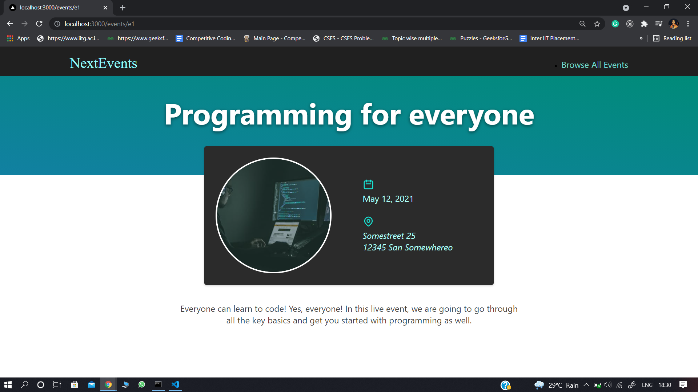
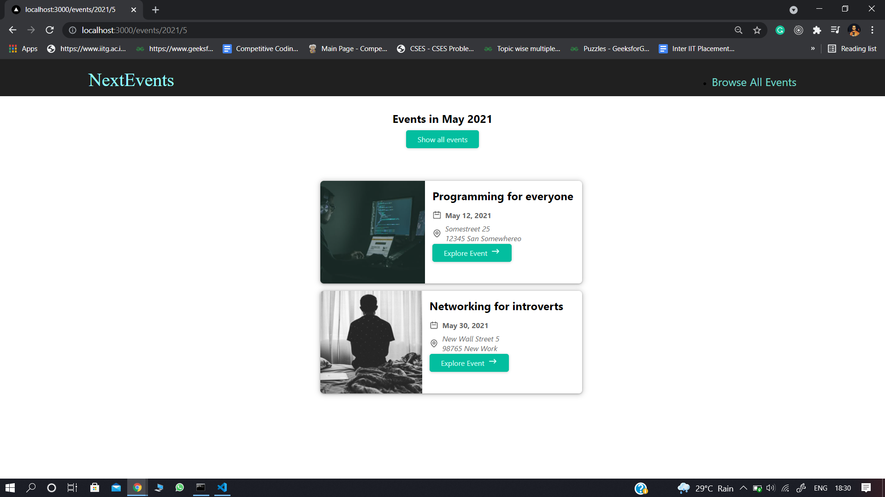

## NextEvents
Next.js Application, lists dummy events.  
Built this to better understand file-based-routing (Next.js feature)

### Next.js
Next.js is an open-source development framework built on top of Node.js   enabling React based web applications functionalities such as server-side rendering   and generating static websites.
(https://nextjs.org/)

### Screenshots

#### 1. All Events Page

#### 2. Event Details Page

#### 3. Filtered Events Page

